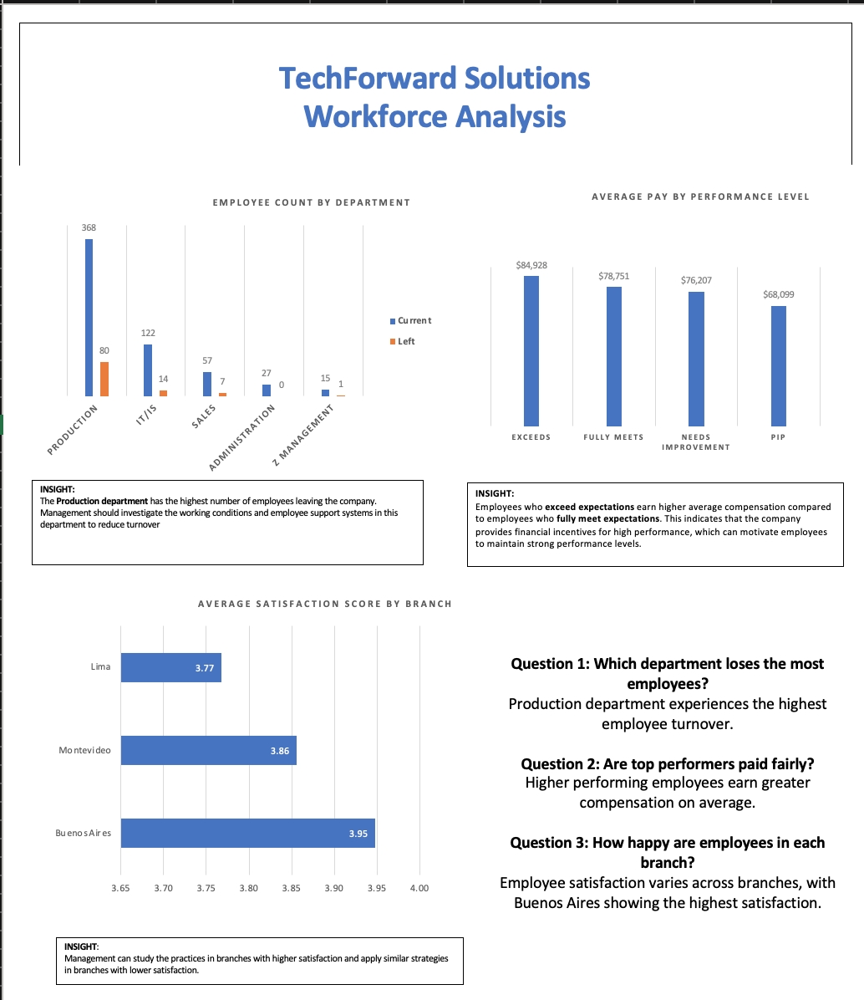

# hr-analytics-excel-dashboard
Excel[HR_Analytics_Capstone_Project]

# 📊 HR Analytics Dashboard (Excel Project)

# Project Overview

This project analyzes employee data to understand workforce retention, satisfaction, and performance using Microsoft Excel.

---

# Business Objectives

* Identify departments with high employee turnover
* Analyze if top performers are paid fairly
* Evaluate employee satisfaction across branches

---

# Tools Used

* Microsoft Excel
* Pivot Tables
* Charts & Dashboard

---

# Data Process

1. Removed duplicates and cleaned dataset
2. Created calculated columns:

   * Tenure
   * Employment Status
   * Satisfaction Level
3. Built pivot tables for analysis
4. Designed charts and dashboard

---

# Key Insights

* Some departments show higher employee exits
* High performance does not always align with higher pay
* Employee satisfaction varies by branch

---

# Recommendations

* Improve retention strategies in high-exit departments
* Align compensation with performance
* Address low satisfaction branches

---

# Dashboard Preview

---

# Author

Umanah Emmanuel
